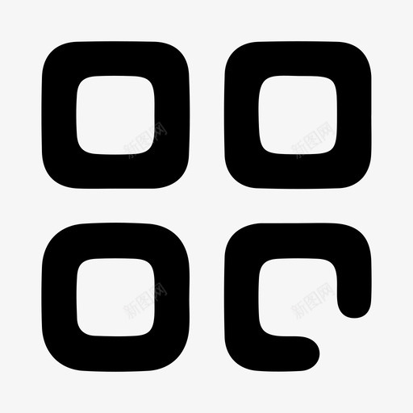

#**《Web应用基础》课程结业报告**
##**1.项目内容描述**
###*（1）项目主题*
该网站的主要主题为针对游戏《怪物猎人 世界》中的武器大剑的教学。教学包括基本信息，新手教学，进阶教学，真蓄教学和视频浏览五个内容。
###*（2）主要内容*
主要内容有五个：1.大剑的基本信息，2.大剑新手教学，3.大剑进阶教学，4.大剑真蓄教学，5.大剑的视频教学。
###*（3）具体描述*
####1.基本信息
关于大剑的基本按键操作和自身特点介绍，明确了大剑的特点和定位。
####2.新手教学
主要分为三个方面 ，即大剑的三个主要攻击模式：拔刀斩，强蓄力斩，真蓄力斩。并分别对这三种招式进行详细介绍。
####3.进阶教学
着重介绍大剑的实战打法思路，技能配装，招式连段，该部分更适用于实战，是比较熟悉招式技能后的部分。
####4.真蓄教学
着重介绍大剑的核心高输出技能，更倾向于在实战中的应用。
##**2.开发过程**
- 1.先建立基本信息页面，确定标题和背景图片，然后建立4个超链接，
  <a class="active" href="csswork2.html">新手教程</a>
        <a class="active" href="csswork3.html">进阶教程</a>
        <a class="active" href="csswork4.html">真蓄教程</a>
        <a class="active" href="csswork5.html">了解更多</a>
 并使用伪类选择器 a:link,a:visited a:hover,a:active，使之更形象。然后展示大剑局内模型照片，使用左浮动让文字与照片同行 ，然后使用两个盒子模型：box-1{
    width: 400px;
    height: 300px;
   
    color: aliceblue;
    border: 10px solid rgb(0, 179, 255);
    padding: 25px;
    margin: 25px;
    float: left;
}
.box-2{
    width: 400px;
    height: 500px;
    background-color: rgb(5, 22, 17);
    color: aliceblue;
    border: 10px solid blue;
    padding: 25px;
    margin: 25px;
      float: left;    
}，分别包含大剑的其他基本信息。
- 2.先使用无序列表确定三个子标题，再使用倾斜字体。在三个子窗口里面，分别确定了固定分隔的行数，并分隔模型的形状和颜色大小，使之更美观。在文本的书写上，采用重点标红的方法，使文本的重点内容更突出，更具可读性。
- 3.先使用js的弹出框功能提示用户是否继续浏览，
  alert("确定访问吗")
  然后利用鼠标点击事件，
  
  将事先隐藏好的窗口弹出，
   .menu {
      
         position: absolute;
         left: -20em;
         top:0;
         z-index: 9999;
         width: 1200px;
         height: 700px;
         margin: 50px auto;
         color: #fff;
         margin-left: 0;
         box-shadow: 1px 1px 1px 1px var(--shadow-color);
         transition: all .4s ease 0ms;
         text-shadow: 0px 0px 5px #000;
     },
  该窗口的弹出时间设置为0.5秒，
  .menu ul li{
         list-style: none;
         height: 50px;
         padding: 10px 0;
         transition: all.5s;
     
     },再使用无序标题的形式分别设置三个目录和文本。还设置了一个返回按钮，使用的是js的返回函数，来返回上一页,.
- 4.先使用一个运行时间为8s的图片滚动动画，
-  .photo{
        float: left;
        width: 6000px;
        height: 250px;
        animation: bj 8s linear infinite;
        },本次使用了5张图片，所以分为5次滚动，
         @keyframes bj{
            0%,
            20%{
             margin-left: 0px;
            }
            25%,
            40%{
                margin-left: -1200px;
            }
            45%,
            60%{
                margin-left: -2400px;
            }
            65%,
            80%{
                margin-left: -3600px;
            }
            85%,
            100%{
              margin-left: -4800px;
            }
        },每次滚动的向左移动一张图片的长度。然后使用无序列表制作目录，然后通过盒子模型输入文本内容，来进行填充。
- 5.先导入一个预先下载好的视频，再使用监听函数，执行鼠标点击事件，播放视频，
  若再次点击，则暂停播放， btnstart.addEventListener("click",function(){
            if(this.innerHTML=="播放"){
            video.play();
                 this.innerHTML="暂停";
            }
            else{
                video.pause();
                this.innerHTML="播放";
            }
            clearInterval(time);
         })。然后设置总时间
          video.onplaying=function()//获取时间并显示到总时间上
        {
            var allTime=video.duration;
            var h=Math.floor(allTime/3600);
            var m=Math.floor(allTime%3600/60);
            var s=Math.floor(allTime%60);
            h=h>=10?h:'0'+h;
            m=m>=10?m:'0'+m;
            s=s>=10?s:'0'+s;
            totaltime.innerHTML=h+":"+m+":"+s;
        }，和当前观看时间， video.ontimeupdate=function(){//更新当前时间
            btntime.value=100*this.currentTime/this.duration;
            var time=this.currentTime;
            var h=Math.floor(time/3600);
            var m=Math.floor(time%3600/60);
            var s=Math.floor(time%60);
            h=h>=10?h:'0'+h;
            m=m>=10?m:'0'+m;
            s=s>=10?s:'0'+s;
            current_time.innerHTML=h+":"+m+":"+s;
        }，使用duration指令获得总时间，并显示在右侧，先获取currentTime，然后按照百分比反映到进度条上，并将当前时间显示在左侧，实时更新。再是进度条拖拽，使用鼠标移动事件，进行进度条的拖拽，再获取当前百分比，反映到当前时间里面， btntime.addEventListener("mousedown",function(){//进度条移动
            this.onmousemove=function(){
                video.currentTime=this.value*video.duration/100;
            }
            this.onmouseup=function(){
                this.onmousemove=null;
                this.onmouseup=null;
            }
        });。最后是快进
             btngo.addEventListener("click",function(){
         
                video.currentTime+=5;          
        })和快退
        btnback.addEventListener("click",function(){
                video.currentTime-=2;
                if(video.currentTime<=0){
                    video.play();
                    clearInterval(time);
                }
        })，都是使用鼠标点击事件，快进为在当前观看时间上加5秒，快退为在当前观看时间上减2秒。
##**3.开发过程中遇到的问题**
  * 1.盒子模型如果使用左浮动，在有些情况会出行两个模型重叠或边框消失的情况。
 * 2.在页面缩小到一定程度时，文本会自动换行，影响界面美观，有时候会打乱界面的格式。
 * 3.在点击按钮后，按钮里面的内容没有发生变化。
 * 4.时间显示不够规范
##**4.解决问题的方法**
* 1.只使用一次左浮动，去除第一个盒子模型的左浮动。
* 2.使用弹性盒子模型，来封装内容，不破坏原本的结构。
* 3.在点击按钮后，使用innerHtml来直接改变按钮里的内容。
* 4.把时间精确到秒，并统一设置为精确到十位。
##**5.总结**
  这次的项目大多数采用的都是原生html和css，并只使用了少数的javascript来制作网页，比较简陋，这次制作涉及了网页的超链接，动画轮播，导航栏隐藏，视频播放等内容，让我进一步熟悉了HTML和js的功能，从只能简单实现网页文本输出，到能展示图片，再到实现文本的分列输出，图片的循环轮播，视频的完整播放暂停和进度拖拽，快进快退，都是此次项目带给我的不小的收获。在此次功能的实现中，html与c++的区别更加显现，html在功能的实现的基础上，更注重形象的美观，信息的直观性，这都是前端的特有的特点，是前端与后端所互补的地方，这造成了两者功能实现思路的不同。抓住了这点，对前端的学习才能更加深入理解代码对其内容的意义，才能更进一步学习html.